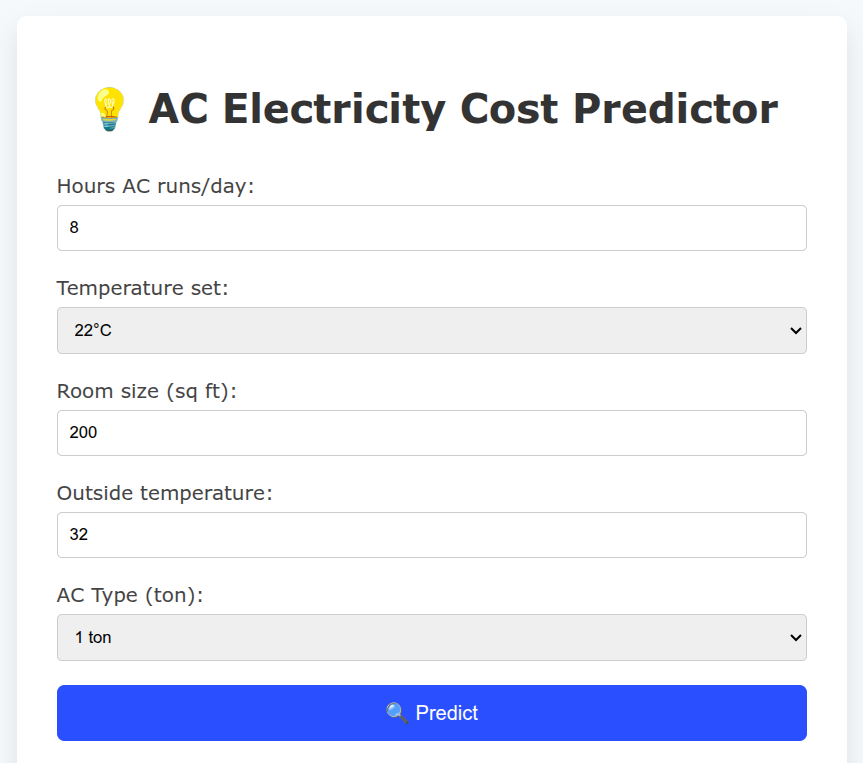
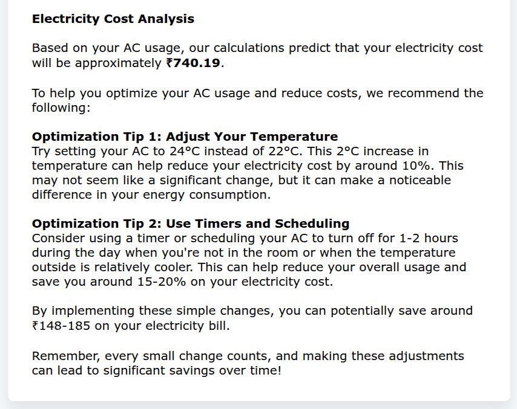

# 🌬️ ACtimize - Your Smart AC Cost Optimizer 🧠⚡

ACtimize is an AI-powered assistant that helps users estimate and optimize their electricity cost based on their AC usage patterns. It combines Machine Learning (XGBoost) for accurate predictions and LLM-powered reasoning to give actionable suggestions for energy savings.

## 🚀 Features

- 🔍 Predict electricity cost using your AC usage and room parameters
- 🧠 Agentic AI using LangGraph for dynamic reasoning and ML tool calling
- 🖥️ React frontend for clean, simple user interaction
- ⚙️ XGBoost model trained on synthetic data
- 💡 Gives cost-saving tips based on your input

## 🛠️ Tech Stack

| Layer     | Tech Used           |
|-----------|---------------------|
| Frontend  | React (Vite)        |
| Backend   | Flask + LangGraph  |
| ML Model  | XGBoost (scikit-learn) |
| LLM       | Groq + LangChain Agents |
| State Mgmt| LangGraph State Machine |

## 🧑‍💻 How It Works

1. 🧾 User enters:
   - AC usage hours
   - Room size
   - Outside temperature
   - Set temperature
   - AC type (tonnage)

2. 📊 ML model predicts electricity cost.

3. 🧠 LLM receives prediction and suggests energy-saving tips.

4. 💬 Response is shown in the frontend in natural language.

---
## Working Images

